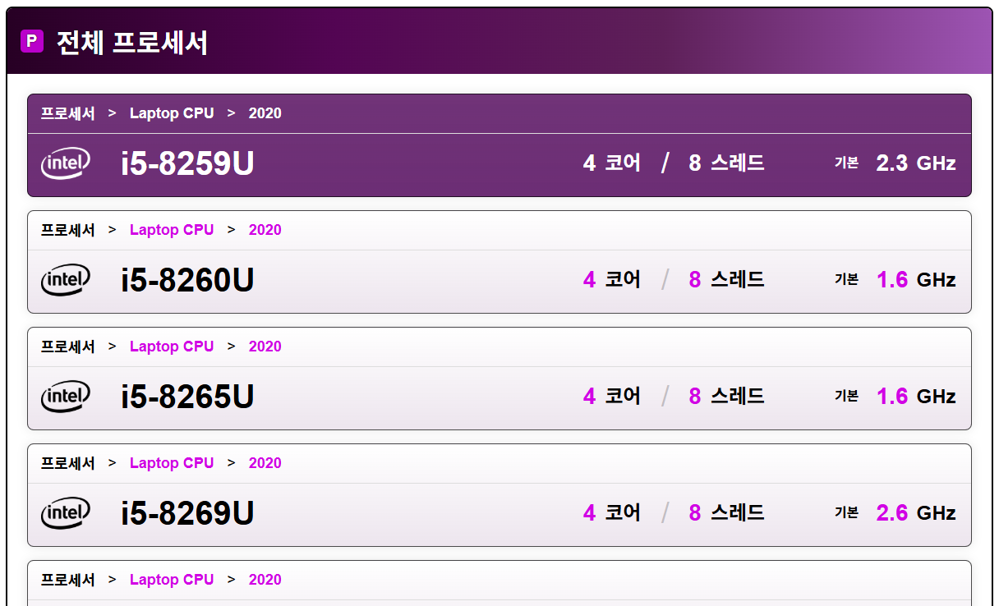
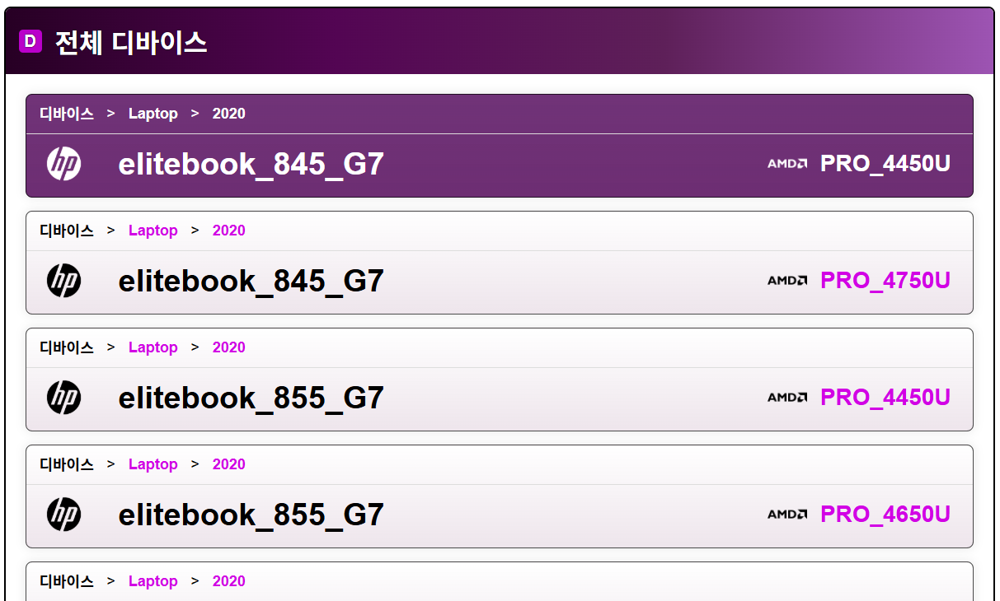

## CHANGELOG 링크
- [CHANGELOG.md](./CHANGELOG.md)

## 애플리케이션 개요
- 애플리케이션 명칭 : **MobileDeviceInfo-2**
- 애플리케이션 유형 : **PHP 웹 애플리케이션**
- 기술 구성 : **Laravel 프레임워크**
- 데이터베이스 : **MySQL 8**
- 서버 구성 : **Nginx 리버스 프록시 + Apache 기반 백엔드**

## 주요 기능

